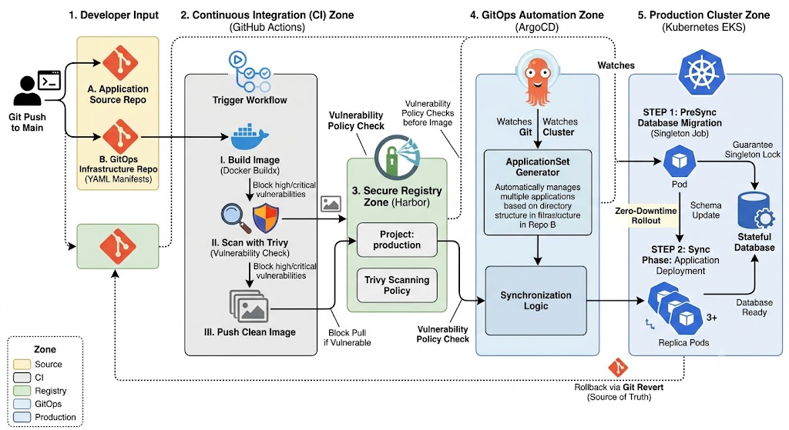

# GitOps Pipeline Configuration

This repository contains the infrastructure configurations and deployment manifests for a GitOps pipeline using AWS EKS, Harbor private registry, ArgoCD, and GitHub Actions.

## System Architecture

The pipeline flow spans source code updates, automated container image building, vulnerability scanning, secure storage, and continuous deployment to the EKS cluster.



---

## Directory Structure

| File / Folder | Purpose |
| :--- | :--- |
| `cluster.yaml` | EKS cluster configuration for `eksctl` in region `ap-south-1`. |
| `gp3-sc.yaml` | StorageClass manifest utilizing the AWS EBS CSI driver. |
| `iam-policy.json` | AWS IAM policy for the AWS Load Balancer Controller. |
| `harbor-application.yaml` | ArgoCD Application manifest deploying Harbor via official Helm chart. |
| `harbor-s3-policy.json` | AWS IAM Policy granting Harbor access to the S3 bucket. |
| `harbor-values.yaml` | Helm overrides for local testing or custom Harbor configurations. |
| `argocd-values.yaml` | Helm values for customizing the ArgoCD controller and ingress settings. |
| `infisical-infra.yaml` | Configuration for Infisical connection and universal authentication. |
| `infisical-static.yaml` | Infisical secret sync declaration targeting the registry namespace. |
| `Dockerfile` | Multi-stage build definition for the web application deployment. |
| `.github/workflows/ci.yml` | GitHub Actions workflow for building, scanning, and pushing images. |
| `templates/applicationset.yaml` | Helm template configuring ArgoCD ApplicationSets for service discovery. |
| `test/cloudflare-tunnel.yaml` | Deployment configuration running Cloudflare Tunnel for secure endpoints. |

---

## Technical Details

### 1. EKS Cluster Provisioning
The cluster is defined in [cluster.yaml](file:///home/ubu/Documents/Devops/project_2/gitops/cluster.yaml). It provisions an Amazon EKS cluster named `zecure-devops-cluster` in `ap-south-1` using `c7i-flex.large` managed worker nodes. The nodes have IAM policy attachments enabled for `autoScaler` and `ebs` (Elastic Block Store) drivers.

Dynamic volume allocation is handled by [gp3-sc.yaml](file:///home/ubu/Documents/Devops/project_2/gitops/gp3-sc.yaml) using the `ebs.csi.aws.com` provisioner, bound in `WaitForFirstConsumer` mode.

### 2. Private Registry Deployment
Harbor is deployed inside the cluster using the ArgoCD manifest [harbor-application.yaml](file:///home/ubu/Documents/Devops/project_2/gitops/harbor-application.yaml).
* **Storage Backend:** Dedicated AWS S3 bucket storage (`zecure-harbor-storage-backend`) in `ap-south-1`. Security permissions are controlled through [harbor-s3-policy.json](file:///home/ubu/Documents/Devops/project_2/gitops/harbor-s3-policy.json).
* **Ingress Management:** Exposes Harbor core components via AWS ALB ingress (`harbor.zecure.tech`).
* **Database & Cache:** PostgreSQL, Redis, and Trivy run with persistent storage allocations on AWS `gp3` EBS volumes.

### 3. Secrets Syncing
Secrets are retrieved dynamically from the Infisical Secrets Manager using the Infisical Operator:
* **Infisical Connection & Auth:** Mapped in [infisical-infra.yaml](file:///home/ubu/Documents/Devops/project_2/gitops/infisical-infra.yaml) using the Universal Auth mechanism.
* **Secret Projection:** Managed by [infisical-static.yaml](file:///home/ubu/Documents/Devops/project_2/gitops/infisical-static.yaml), which syncs secrets from the staging path (`/production-registry` under project `gitops-z8vu`) directly to the Kubernetes Secret named `harbor-core` inside the `harbor` namespace.

### 4. Continuous Integration Pipeline
The GitHub Actions workflow in [.github/workflows/ci.yml](file:///home/ubu/Documents/Devops/project_2/gitops/.github/workflows/ci.yml) automates the build and security checks:
1. **Docker Buildx:** Compiles the container image using the project's [Dockerfile](file:///home/ubu/Documents/Devops/project_2/gitops/Dockerfile).
2. **Trivy Vulnerability Scan:** Scans the newly compiled image. The workflow fails (exit code 1) if `CRITICAL` or `HIGH` vulnerabilities are found, halting the deployment.
3. **Registry Push:** If the scan passes, the image is tagged with both the commit SHA and `latest`, and pushed to the private Harbor registry.

### 5. GitOps CD Engine
Continuous Delivery is driven by ArgoCD. The template [templates/applicationset.yaml](file:///home/ubu/Documents/Devops/project_2/gitops/templates/applicationset.yaml) uses a Git generator to monitor directories under `apps/*`. When a new service subdirectory is added, ArgoCD automatically generates a corresponding Application and deploys it to EKS.

---

## Deployment Steps

### Step 1: Deploy EKS Cluster and CSI Driver
```bash
eksctl create cluster -f cluster.yaml
```

Attach the required IAM policies to the service accounts for EBS volume provisioning:
```bash
eksctl create iamserviceaccount \
  --name ebs-csi-controller-sa \
  --namespace kube-system \
  --cluster zecure-devops-cluster \
  --attach-policy-arn arn:aws:iam::aws:policy/service-role/AmazonEBSCSIDriverPolicy \
  --approve \
  --role-only

kubectl apply -f gp3-sc.yaml
```

### Step 2: Install Infisical Operator and Sync Secrets
Install the Infisical Kubernetes Operator, then apply the infrastructure connection configurations:
```bash
kubectl apply -f infisical-infra.yaml
kubectl apply -f infisical-static.yaml
```

### Step 3: Install ArgoCD and Harbor
Bootstrap ArgoCD on the cluster, configure overrides, and apply the application manifest to deploy Harbor:
```bash
kubectl create namespace argocd
kubectl apply -n argocd -f https://raw.githubusercontent.com/argoproj/argo-cd/stable/manifests/install.yaml

kubectl apply -f harbor-application.yaml
```

### Step 4: Configure Repository Secrets for GitHub Actions
Define the following GitHub Secrets under repository settings:
* `HARBOR_URL`: URL of your Harbor instance (e.g. `harbor.zecure.tech`)
* `HARBOR_USERNAME`: Registry service account/robot name
* `HARBOR_TOKEN`: Harbor access token/password

Push updates to the `main` branch to trigger automated builds.

---

## Proof of Work

The pipeline and infrastructure deployments have been verified as functional:

### 1. CI Pipeline Completion
The GitHub Actions workflow successfully compiles the image and passes security scanning without critical failures.


### 2. Secure Storage in Harbor
Container artifacts are pushed to the registry under the `production/secure-app` repository and show complete scan summaries.


### 3. ArgoCD Deployment State
The active resources running on EKS are managed and kept synchronized in a healthy state by ArgoCD.


